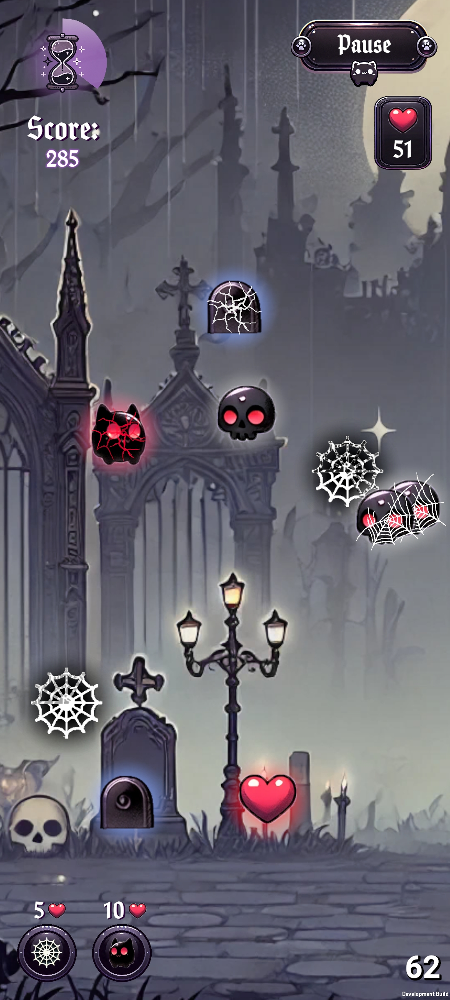

#   Gothic Kitty  

## 🕹 Game Description
This is a mobile game with a gothic yet cute visual style. It’s designed to be simple but engaging — perfect for passing time while commuting or taking short breaks.

## 🧠 The Goal of the Game
The game features multiple modes, with the first being the **"Timer Mode"**. The goal is to score as many points as possible before the timer runs out and collect hearts — the game’s main currency. Hearts can be used to purchase helpful items during gameplay.

## 📱 Screenshots / Gifs
<p>
  
  
  
</p>
<p>
  
  
  
</p>

## 🎮 Gameplay Elements
- **Appearing Entities:**
  -  *Hearts* — clickable, grant points.
  -  *Skulls* — clickable, reduce points. If caught in a web, they grant points.
  -  *Tombstones* — can be broken by clicking; they destroy hearts, repel skulls, and give points upon destruction.

- **Placeable Entities:**
  -  *Webs* — slow down skulls, but eventually break.
  -  *Kitten* — collects hearts and destroys skulls but can be damaged by them.

There are also **timer-based entities** (hearts and skulls) that extend or reduce the time limit when collected.

- **Kitty-Companion**
<table>
  <tr>
    <td>
      
    </td>
    <td style="padding-left: 20px;">
      <p>On the main screen, the player is greeted by an animated kitty, who acts as the game’s mascot and companion. The kitty reacts to clicks, releases hearts, and meows. In future updates, it will be able to speak phrases, give tips, and perform idle actions like playing, grooming, or sleeping depending on the time spent on the menu.</p>
    </td>
  </tr>
</table>

## ✨ Features
- **Gothic and cute aesthetic** — a charming blend of cozy visuals and a slightly eerie atmosphere.
- **Timer-based gameplay** — try to collect as many points and hearts as possible before time runs out.
- **Simple click-based mechanics** — perfect for quick play sessions during short breaks.
- **Light strategy elements** — choose when and where to place entities to maximize your score and heart collection.
- **Multiple game modes** — Timer, Story, Levels.
- **Variety of entities** — each with unique features that influence gameplay.
- **Animated kitty-companion** — the main character and your helper, keeping you company with cute animations.
- **In-Game shop** — unlock decorations, backgrounds, upgrades, and more using collected hearts.

## 📦 Installation and Launch
1. Clone the repository:
   ```bash
   git clone https://github.com/protsenkovlad25/CuteGothicCatcher.git
   ```
2. Open the project in Unity (version 2022.3.45f1 or higher).
3. Launch the SampleScene via Assets/Scenes.
4. Press ▶ to start.

## ⚙️ Dependencies
- Unity 2022.3.45f1 LTS
- TextMeshPro
- DOTween
- LunarConsole
- NewtonsoftJSON

## 🔨 Build Instructions
1. Go to **File → Build Settings**
2. Select the **Android** platform
3. Click **Build**
4. Choose the build save location
5. The build is ready

## 🧪 TODO
- A **shop** with decorations and upgrades
- Player **profile**
- Performance **statistics**
- **Leaderboard**
- **Sounds and music**
- **In-game purchases** (buy hearts with real currency)
- **Codex** with descriptions of items and entities
- **Game modes**: Story Mode and Levels Mode
- Kitty **animations and behaviors**
- **New entities**
- **Settings**
- **Balance** of game modes and entities

## 👨‍💻 Contribution
PRs and ideas are welcome! You can also create issues to report bugs or suggest features.
